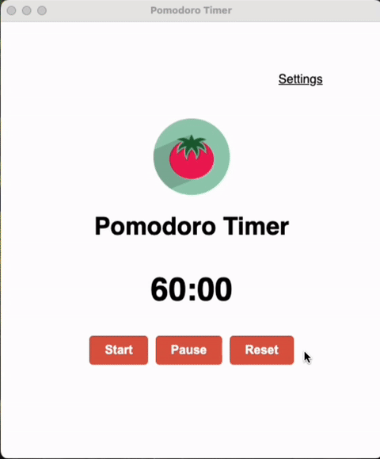

# Pomodoro timer

Exciting pomodoro timer app packaged with electron (for macOS, Linux and Windows) :tomato:

To create the package: install dependencies and run npm scripts for the desired environment.
